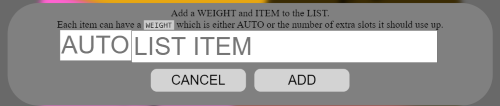

# Human Friendly Wheel!
This is a wheel that is highly customizable just by using a Interface.<br>
Also many thanks to winWheel.js this 100% wouldn't be possibly without it. Check it out [here](http://dougtesting.net/home)!

## Features
 - Lottery Wheel that selects an item by random.
 - Lottery Wheel's contents customizable.
 - Lottery Wheel's colors customizable.
 - Auto adjust text size, so the text always fits.
 - Ability to remove content you've already won or spun.
 - Easy to use Editors.
 - Ability to import contents.
 - Ability to download your wheel's settings.
 - Saves the content to your browser. (Your data is never seen by my server)
 - Easy on the Eyes Interface
 
 ---
 
# Details on how to use
Just in case you have a question on ANYTHING on this, everything this wheel has should be covered, if it's not in this list, I probably don't have support for it.

###Accessing the sidebar
In the main page you should see a hamburger menu in the top left, it looks something like:<br>
<br>
Click it to open the sidebar, then click it again to close it

### Adding items to the wheel
Open the side bar, and in the very top there is the category LIST. This is all the things that will be displayed on the wheel. There are 3 methods of adding items.
 - **Using the Editor**
    - If you click the long button with the label LIST it will open up an editor that looks like:<br>
    <br>
    Every line is a different item on the wheel. **Note:** That at the start of every line must either be AUTO or a number followed by a _space_ then _vertical line_ then _space_. So it should be very similar to this: `AUTO | My New Item` or `2 | My Other Item`. The AUTO or Number is the **weight** of the item. _(Discussed [later](#what-does-weighting-do))_
 - **Add Button**
    - Under the list of items and the LIST button, there is a button with a `+` as it's label. If you click it, you will be greeted by this GUI:<br>
    <br>       
    It should be simple, leave the weight empty for AUTO or input a number. Then fill in what you want the new segment to be labeled.
 - **Importing**
    - This is for more experienced people. You can choose to upload a JSON file to auto fill your wheel. (_**Note:** Importing rules will be discussed [later](#Importing)_)   

### Skipping
 Instead of deleting items from the list, you can just _skip them_, so the end result is that they are still not on the wheel but you didn't delete them so you can have them back at any time. To skip an item on the list you need to add that same item **_case for case_**. So `My Item` will skip `My Item` but won't skip `My item` or `My Item 2`. 
 
 So to start you need to enable skipping, if you look on the sidebar there is a checkbox next to a greyed out SKIP.<br>
 <br>
 Just click on the checkbox to start skipping items. Once you have the checkbox checked a few new things will appear, for starters you now can see the `+` button and the `Import` button, and a new button `select` will show up when you spin or have spun the wheel.

### Adding items to be skipped
Open the side bar, and in the middle there is the category SKIP. This is all the things that will be skipped and subsequently not be displayed on the wheel. There is 4 methods of adding items.
 - **Using the Editor**
    - If you click the long button with the label LIST it will open up an editor that looks like:<br>
    <br>
    Every line is a different item on the wheel. **Note:** you need to match the item you want to skip **_case for case_**. So `My Item` will skip `My Item` but won't skip `My item` or `My Item 2`.
 - **Add Button**
    - Under the list of items to be skipped and the SKIP button, there is a button with a `+` as it's label. If you click it, you will be greeted by this GUI:<br>
    <br>       
    It should be simple, Just fill in what you want skip. **Note:** you need to match the item you want to skip **_case for case_**. So `My Item` will skip `My Item` but won't skip `My item` or `My Item 2`.
 - **Importing**
    - This is for more experienced people. You can choose to upload a JSON file to auto fill your wheel. (_**Note:** Importing rules will be discussed [later](#Importing)_)   
 - **Selecting**
    - After spinning the wheel, and the skip checkbox is checked a button labeled `select` will appear.<br>
    <br>
     Clicking this button adds the winning item to the list, and prevents re-spins. 
 
### Adding different colors to the wheel.
Every item on the wheel is a color controlled by the color table. The very bottom category on the sidebar. There is 3 methods of adding items.
 - **Using the Editor**
    - If you click the long button with the label LIST it will open up an editor that looks like:<br>
    <br>
    Every line is a different item on the wheel. **Note:** you must have a valid hexcode on each line. That is a `#` followed by 6 numbers or letters.<br>
    **Note:** You can click on the colored squares to open up a color picker to edit the current line.
 - **Add Button**
    - Under the list of items to be skipped and the SKIP button, there is a button with a `+` as it's label. If you click it, you will be greeted by this GUI:<br>
    <br>       
    It should be simple, Just fill in what you want skip. **Note:** you must have a valid hexcode. That is a `#` followed by 6 numbers or letters.<br>
    **Note:** You can click on the colored square to open up a color picker.
- **Importing**
    - This is for more experienced people. You can choose to upload a JSON file to auto fill your wheel. (_**Note:** Importing rules will be discussed [later](#Importing)_)   

### Removing items from lists.
Once you spun something on the wheel you may not want it to be shown on the wheel again, or you made a mistake and added something to a list by accident. Well lucky for you there is a bunch of ways to fix this. **Note:** The following methods work for all 3 lists. (List, Skip & Colors)
 - **Deleting from the Editor**
   - If you see above on how to access the Editor for whichever list you wish to edit<br>
   <br>
   You can easily remove several lines to remove several items. This is the easiest way to remove multible items.
 - **Deleting from the List**
   - If you look at the list<br><br>You can see there is a trashcan to the left of each item. Just click the trashcan and that item will be deleted.
 - **Deleting Weights**
   - If you have a weighted item next to your weighted item will be an icon of a weight.<br>
   <br>
   Clicking this icon removes the weight on that item.

### What does Weighting do?
Do you want a particular item have a better chance of winning than the others? Well weighting improves chances of that item. To explain how this works, imagine the wheel has 8 slices. However you found out last minute 2 of the slices combined into a single double slice. Now turn the pizza into a wheel, and you have 6 regular slices and 1 double slice. This is how weighing works, it grabs an extra slice for itself.

You can stack weighting as well for example this list:
```
AUTO | Item 1
1 | Item 2
3 | Item 3
auto | Item 4
```
Would create this weighted wheel:<br>
<br>
If you notice the there is 8 slices, But `Item 3` took `3` extra slices and is now 4/8 slices while `Item 2` only took `1` extra slice.

### Importing
Depending on what you are importing the requirements differ. But they all need to be JSON files.
 - Importing List
    - Must either be an array `["Value","Value2"]` or an object with a `list` property `{"list":["Value","Value2"]}`;<br>
    Can have an optional weights or weight property. `{"list":["Value","Value2"],"weights":["auto","2"]}`
 - Importing Skip
    - Must either be an array `["Value","Value2"]` or an object with a `toSkip` property `{"toSkip":["Value","Value2"]}`;
 - Importing Colors
    - Must either be an array `["#ff0000","#00ff00"]` or an object with a `colors` property `{"colors":["#ff0000","#00ff00"]}`;  

### To Other Developers
All data is saved via localStorage on [index.js:2](Index.js) it should be very easy to modify the save/load.

And if you need to get settings there is the EXPORT WHEEL SETTINGS button at the very bottom of the sidebar 

**Note:** I'm 90% sure the weight img & the trashcan is copyrighted, it was just something I found on my computer. I highly advise using different images if you plan on using this for commercial purposes.
---
## Ideas
These are just ideas, depending on my time and how well this project goes, I may add them
<br>(Ranked in likely hood of being added)
 - Have the export button export a html/js file having exactly the barebones needed to recreate the wheel. (JSON export is missing things like sounds & pointer)
 - Design custom weight/trashcan images, so they are copyright free.
 - Add a checkbox to disable/enable pointer.
 - Add a button that hides the sidebar. (SHIFT+S maybe re-shows it)
 - _**Issue:**_ The wheel doesn't start out with a pointer, but gets it as soon as wheel updates.
 - _**Issue:**_ The _addListButton GUI's_ weight input is higher by 1-2 px
 - Have the pins customizable.
 - Let the user change the winning color, and the losing colors.
 - Have the sounds customizable (maybe have a few choices & allow the user to upload more).
 - Maybe add settings that allow user to change text/background/border color of the objects.
 - Let the user choose location of the pointer.
 - Maybe add customization to the pointer such as img/color/size.
 - Make the webpage look nice for every size.

